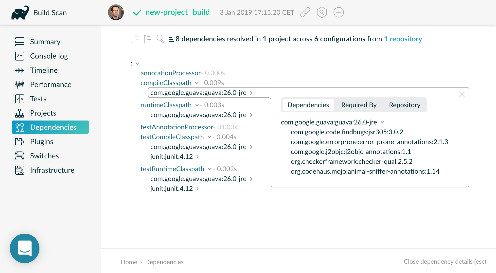
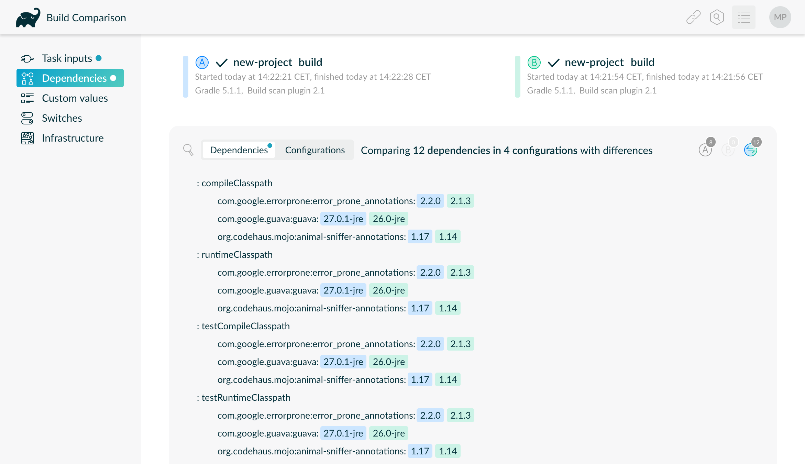

<!-- .slide: data-background="#01313a" data-background-image="/assets/gradle-title.png" data-background-size="cover" data-transition="fade" -->

# Gradle -- Build Happiness
<!-- .element style="font-size:160%; text-align:right; margin-top:-300px" -->

### Marc Philipp, Gradle Inc.
<!-- .element style="text-align:right" -->

----

##  <!-- .element style="width:25%; float:right;" --> Marc Philipp

*Software Engineer bei Gradle, Inc.*

JUnit Maintainer seit 2012

*Twitter:* [@marcphilipp](https://twitter.com/marcphilipp)
*Web:* [marcphilipp.de](https://www.marcphilipp.de)

----

# ✋

## Show of Hands

----
<!-- .slide: data-background="#01313a" data-background-image="/assets/gradle-subsection.png" data-background-size="cover"-->
# Was ist Gradle?

----

## Was ist Gradle?

> Gradle ist ein Build- und Automatisierungswerkzeug.

* Basiert auf der Java Virtual Machine (JVM)
* Implementiert in Java
* 100% Open Source (Apache 2.0) und kostenlos

----

## Vielseitig einsetzbar

* Java-Ökosystem: Java, Groovy, Kotlin, Scala, ...
* Native Projekte: C, C++, Swift, ...
* Android
* Sonstiges: Go, Asciidoctor, ...


<!-- .element class="plain" -->

----

## Gradle in Zahlen

* Mehr als 7M Downloads/Monat
* OSS-Projekt #17 weltweit
* 35+ Gradle Engineers
* 300K Builds/Woche @ LinkedIn

----

## Gradle Inc.

* Vision: *Build Happiness*
* Mission: *Accelerate Developer Productivity*
* Produkte: *Build Scans* and *Enterprise Build Cache*
* [Consulting, Support, Development Services etc.]
* [Training: online, öffentlich und in-house]

----

## Agenda

* Kurze Einführung in Gradle
* Gradle Plugins
* Inkrementelle Builds
* Build Scans
* Build Cache

---
<!-- .slide: data-background="#01313a" data-background-image="/assets/gradle-subsection.png" data-background-size="cover"-->
# Kurze Einführung in Gradle

----

## Hello World

```gradle
tasks.register("helloWorld") { // in build.gradle
  doLast {
    println("Hello World!")
  }
}
```

```
$ gradle helloWorld

> Task :helloWorld
Hello World!

BUILD SUCCESSFUL in 0s
1 actionable task: 1 executed
```

----

## Tasks

- Ein Gradle-Build führt einen/mehrere Tasks aus.
- Tasks können von anderen Tasks abhängen.
- Tasks haben Inputs und Outputs.

----

## Buildscripts

Ein Gradle-Projekt wird mittels Buildscripts konfiguriert:

- `settings.gradle[.kts]`: Konfiguriert, welche Subprojekte Teile des Builds sind.
- `build.gradle[.kts]`: Konfiguriert Plugins und Tasks, die im Build verwendet werden.

----

## Gradle Wrapper

`./gradlew <tasks>` statt `gradle <tasks>`

- Ermöglicht Ausführung des Builds ohne vorherige Installation von Gradle: Lädt ggfs. die benötigte Version herunter.
- Entwickler und Build-Server verwenden immer diesselbe Version.

----

## Dateistruktur

```plain
$ gradle init --dsl=kotlin --type=java-application \
              --test-framework=junit --package=com.example \
              --project-name=new-project

BUILD SUCCESSFUL in 0s
2 actionable tasks: 2 executed
```

```c
├── build.gradle.kts    // Buildscript
├── gradle/wrapper      // Wrapper JAR und Konfiguration
├── gradlew             // Wrapper script für Linux/macOS
├── gradlew.bat         // Wrapper script für Windows
├── settings.gradle.kts // Settings
└── src                 // Java source tree
    ├── main
    │   ├── java
    │   └── resources
    └── test
        ├── java
        └── resources
```

----

## settings.gradle.kts

```kotlin
rootProject.name = "new-project"
```

----

## build.gradle.kts

```kotlin
plugins {
    java // zum Kompilieren von Java-Quellcode
    application // zum Generieren von Startup-Scripts
}
repositories {
    jcenter() // zum Auffinden von Dependencies
}
dependencies {
    implementation("com.google.guava:guava:26.0-jre")
    testImplementation("junit:junit:4.12")
}
application { // Extension des 'application'-Plugins
    mainClassName = "com.example.App"
}
```

----

## Groovy vs. Kotlin DSL

- Buildscript verwenden eine Domain-Specific-Language (DSL).
- Ursprünglich wurde dazu *Groovy* verwendet.
- Groovy: Dynamisch typisiert, IDE-Support schwierig
- Seit Gradle 5.0 gibt es eine stabile DSL in *Kotlin*.

---
<!-- .slide: data-background="#01313a" data-background-image="/assets/gradle-subsection.png" data-background-size="cover"-->
# Gradle Plugins

----

## Plugins

```kotlin
plugins {
    java // zum Kompilieren von Java-Quellcode
    application // zum Generieren von Startup-Scripts
}
```

- Definieren Tasks, z.B. `compileJava`
- Stellen Möglichkeiten zur Konfiguration bereit, z.B. die `application`-Extension
- Wenden andere Plugins an

----

## Eigene Plugins

Ziel: Vereinheitlichung der Build-Logik über Projekt-Grenzen hinweg

```kotlin
plugins {
    id("com.example.myplugin") version "1.0"
}
```

```java
public class MyPlugin implements Plugin<Project> {
  @Override public void apply(Project project) {
    project.getPluginManager().apply(JavaPlugin.class);
    project.getTasks().register("myTask", task -> ...);
    // ...
  }
}
```

----

## Plugin Portal

Über 3000 Community-Plugins


<!-- .element class="plain" -->

---
<!-- .slide: data-background="#01313a" data-background-image="/assets/gradle-subsection.png" data-background-size="cover"-->
# Inkrementelle Builds

----

## Inkrementelle Builds

- Führe nur Tasks aus, die von Änderungen zwischen zwei Builds betroffen sind.
- Behalte die Ergebnisdateien aller Tasks die _up-to-date_ sind.

----

## Erster Build

```plain
$ ./gradlew --console=plain build
> Task :compileJava
> Task :processResources NO-SOURCE
> Task :classes
> Task :jar
[...]
> Task :compileTestJava
> Task :testClasses
> Task :test
> Task :check
> Task :build

BUILD SUCCESSFUL in 5s
7 actionable tasks: 7 executed
```

----

## Inkrementeller Build

```plain
$ ./gradlew --console=plain build
> Task :compileJava UP-TO-DATE
> Task :processResources NO-SOURCE
> Task :classes UP-TO-DATE
> Task :jar UP-TO-DATE
[...]
> Task :compileTestJava UP-TO-DATE
> Task :testClasses UP-TO-DATE
> Task :test UP-TO-DATE
> Task :check UP-TO-DATE
> Task :build UP-TO-DATE

BUILD SUCCESSFUL in 0s
7 actionable tasks: 7 up-to-date
```

----

## Wenn wir Zeit hätten...

- Compile avoidance & incremental compiler
- Gradle Daemon
- Continuous Builds
- Composite Builds
- Tooling API / IDE integration
- Worker API

---
<!-- .slide: data-background="#01313a" data-background-image="/assets/gradle-subsection.png" data-background-size="cover"-->
# Build Scans

----

## Build Scan: Aktivierung

```plain
$ ./gradlew build --scan

BUILD SUCCESSFUL in 1s
7 actionable tasks: 5 executed, 2 up-to-date

Publishing build scan...
https://gradle.com/s/lu7dxy7quyoju
```

› https://gradle.com/s/lu7dxy7quyoju

----

## Build Scan: Timeline


----

## Build Scan: Dependencies



----

## Build Scans (kostenlos)

- Beschleunigen die Lösung von Build-Problemen
- Einfach mit Kollegen teilbarer Link
- Kostenlose Nutzung auf [scans.gradle.com](https://scans.gradle.com/)

----

## Enterprise Build Scans

*Gradle Enterprise* bietet zusätzliche Features:

- Hosting auf eigenem Server
- Vergleich zweier Build Scans
- Entwicklung von Build-Metriken über die Zeit

----

## Builds über die Zeit


<!-- .element style="width:80%" -->

----

## Vergleich zweier Builds



---
<!-- .slide: data-background="#01313a" data-background-image="/assets/gradle-subsection.png" data-background-size="cover"-->
# Build Cache

----

## Morgens halb 10 in Deutschland...

```plain
$ git pull
[...]
185 files changed, 4320 insertions(+), 1755 deletions(-)
```
<!-- .element class="fragment" -->

```plain
$ ./gradlew --build-cache sanityCheck

BUILD SUCCESSFUL in 1m 11s
1338 actionable tasks: 238 executed, 1100 from cache
```
<!-- .element class="fragment" -->

_Give every developer back one hour a day!_
<!-- .element class="fragment" -->

----

## Build Cache

Verwende Ergebnisse _aller_ vorherigen Builds


<!-- .element class="plain" -->

----

## Inputs → Task → Outputs

- Berechne _cacheKey_ eines Tasks aus dessen Inputs:
  _cacheKey(javaCompile)_ = _hash(sourceFiles, ...)_
- Verwende Ergebnisdateien als _cacheEntry_:
  _cacheEntry(javaCompile)_ = _fileTree(classFiles)_

----

## Remote Build Cache


<!-- .element class="plain" -->

----

## Lokal und Remote

- CI-Server speichern Task-Ergebnisse im Remote Build Cache
- Lokale Builds verwenden Ergebnisse aus dem Remote Build Cache
- Ergebnisse werden für zukünftige Builds im lokalen Build Cache gespeichert

----

## Gradle Enterprise


<!-- .element class="plain" style="width:700px" -->

----

## Neu: Jetzt auch für Apache Maven™️

<video class="stretch" controls="controls" src="maven-with-build-cache.webm"></video>

› https://gradle.com/blog/maven/

----

### Gradle Enterprise Kunden


<!-- .element class="plain" style="width:90%" -->

› [gradle.com](https://gradle.com)

---
<!-- .slide: data-background="#01313a" data-background-image="/assets/gradle-subsection.png" data-background-size="cover"-->


<!-- .element class="plain" style="width:40%" -->

# Q & A
