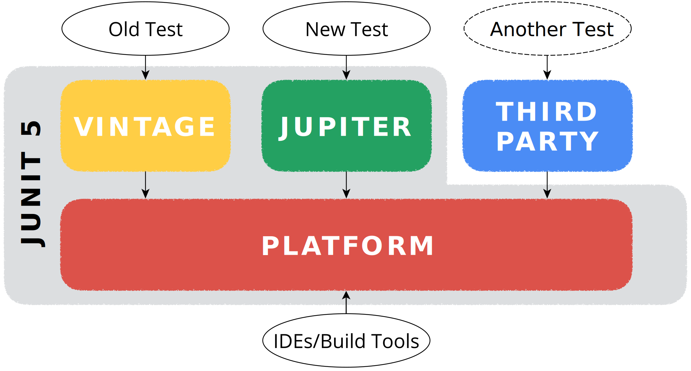

<!-- .slide: data-background="./geecon-background.jpg" -->
# JUnit 5 Extensions
<!-- .element style="color:white" -->

<hr style="border-color:white; width:25%;">

## Marc Philipp
<!-- .element style="color:white" -->

----

##  <!-- .element style="width:30%; float:right;" --> Marc Philipp

*Software Engineer at  <!-- .element class="plain" style="vertical-align: -35px; height:2em;" -->*

JUnit Maintainer since 2012

*Twitter:* [@marcphilipp](https://twitter.com/marcphilipp)
*Web:* [marcphilipp.de](https://www.marcphilipp.de)

---

## 🎉<br>JUnit 5 is here!

**5.0**
September 10, 2017

**5.1**
February 18, 2018

**5.2**
April 29, 2018

----


<!-- .element class="plain" style="width:100%" -->

----

## JUnit Jupiter


<!-- .element class="plain" style="width:50%" -->

----

## JUnit Jupiter API

- programming model for test authors
- extension model for extension authors

----

## Programming model

```java
import org.junit.jupiter.api.*;
import static org.junit.jupiter.api.Assertions.*;

class SimpleTest {
    @Test
    @DisplayName("1 + 1 = 2")
    @ExtendWith(MyCustomExtension.class)
    void onePlusOneEqualsTwo() {
        assertEquals(2, 1 + 1);
    }
}
```

----

## Extension Model

```java
import org.junit.jupiter.api.extension.*;

class MyCustomExtension
        implements BeforeEachCallback, AfterEachCallback {
    @Override
    public void beforeEach(ExtensionContext context) {
        // setup
    }
    @Override
    public void afterEach(ExtensionContext context) {
        // teardown
    }
}
```

----

## Extension Registration

- Declarative: `@ExtendWith` on classes or methods
- Programmatic: `@RegisterExtension` on fields
- Global: Via `ServiceLoader` (see [User Guide](https://junit.org/junit5/docs/current/user-guide/#extensions-registration-automatic))

---

# Conditional Test Execution

----

## Demo

----

## Extension Context

* Represents the current node in the test tree, e.g. test method or class
* Provides access to meta information about such a node, e.g. display name, method, class

----

## Extension Context


<!-- .element class="plain" style="width:100%;" -->

----

## Lessons Learned

* Using custom logic to determine whether a test class/method should be skipped
* Registering an extension *globally*
* Deactivating a condition without changing the code

---

# Reusable Test Setup & Teardown

----

## Demo

----

## Why the Store abstraction?

```java
extensionContext
    .getStore(Namespace.create(...))
    .getOrComputeIfAbsent("key", key -> ...)
```

* An extension needs to save and retrieve data, e.g. to clean up in the end
* `Extensions` are instantiated once and called for multiple tests
* Using instance variables would be error-prone

----

## Store

* `Map`-like interface for extensions to save and retrieve data, e.g. `store.put(key, value)`
* Accessed via a `Namespace`: Enables sharing data across extensions, but makes it a deliberate decision (e.g. `Namespace.GLOBAL`)
* Reading from a `Store` follows the hierarchy upwards, if a key is not found

----

## Store


<!-- .element class="plain" style="width:100%;" -->

----

## Automatic Clean-Up

`CloseableResource` instances in a `Store` are automatically closed when the scope of the corresponding `ExtensionContext` ends.

```java
class DockerClientResource implements CloseableResource {
    private final DockerClient dockerClient;

    DockerClientResource() {
        var config = DefaultDockerClientConfig.createDefaultConfigBuilder().build();
        dockerClient = DockerClientBuilder.getInstance(config).build();
    }
    DockerClient get() {
        return dockerClient;
    }
    @Override public void close() throws Throwable {
        dockerClient.close();
    }
}
```

----

## Lessons Learned

* Using the `Store` class for extension state
* Using Lifecycle Callbacks to enable reuse of common setup/teardown code
* Implementing multiple `Extension` interfaces in a single extension

---

# Resolving Test Parameters

----

## Demo

----

## Lessons Learned

* How to resolve test method parameters in an `Extension`?
* You can also inject parameters into test class constructors and `@BeforeEach`/`@AfterEach` methods etc.

---

# Providing Arguments for Parameterized Tests

----

## Demo

----

## Lessons Learned

* Using Parameterized Tests
* Writing a custom `ArgumentsProvider` that loads data from a JSON file, ...

---

# From Tests to Test Templates

----

## Demo

----

## Lessons Learned

* Executing a test multiple times with different contexts
* Implementing a `TestInvocationContextProvider`

----

## Support Classes

Package `org.junit.platform.commons.support` contains:

* `AnnotationSupport` to scan for custom annotations, including meta-annotations
* `ReflectionSupport` for classpath scanning, finding methods, invoking them etc.

---

# Summary

----

## Extension Points

- Lifecycle: `BeforeAllCallback`, `BeforeEachCallback` ✅, `BeforeTestExecutionCallback`, `TestExecutionExceptionHandler`, `AfterTestExecutionCallback`, `AfterEachCallback` ✅, `AfterAllCallback`
- Other: `ExecutionCondition` ✅, `TestInstancePostProcessor`, `ParameterResolver` ✅, `TestTemplateInvocationContextProvider` ✅

----

## JUnit Jupiter is extensible

- A lot of extension points to choose from
- The JUnit team will add more in future releases
- Combining multiple extension points in one extension is very powerful!

----

## Third-Party Extensions

Spring, Mockito, Docker, Wiremock, JPA, Selenium/WebDriver, DbUnit, Kafka, Jersey, GreenMail, S3Mock, Citrus Framework, XWiki, ...

<https://github.com/junit-team/junit5/wiki/Third-party-Extensions>

----

## Getting Started

* User Guide:
  http://junit.org/junit5/docs/current/user-guide/
* Sample projects for Gradle, Maven, and Ant:
  https://github.com/junit-team/junit5-samples
* Javadoc:
  http://junit.org/junit5/docs/current/api/

----

## Wanted: Feedback!

* StackOverflow:
  http://stackoverflow.com/questions/tagged/junit5
* Code & Issues:
  https://github.com/junit-team/junit5/
* Twitter:
  https://twitter.com/junitteam

----

## Example code

https://github.com/marcphilipp/junit5-extensions-demo

----

# Questions?

&nbsp;

👉 [@marcphilipp](https://twitter.com/marcphilipp) or [@junitteam](https://twitter.com/junitteam)

----

# Thanks!
