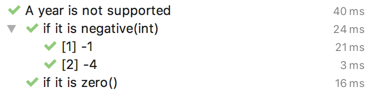
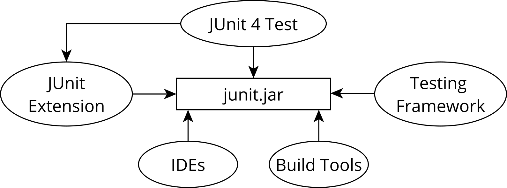
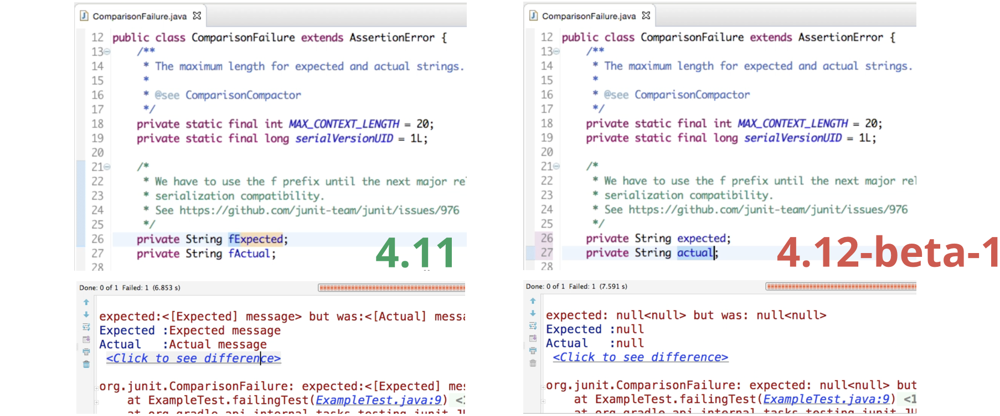
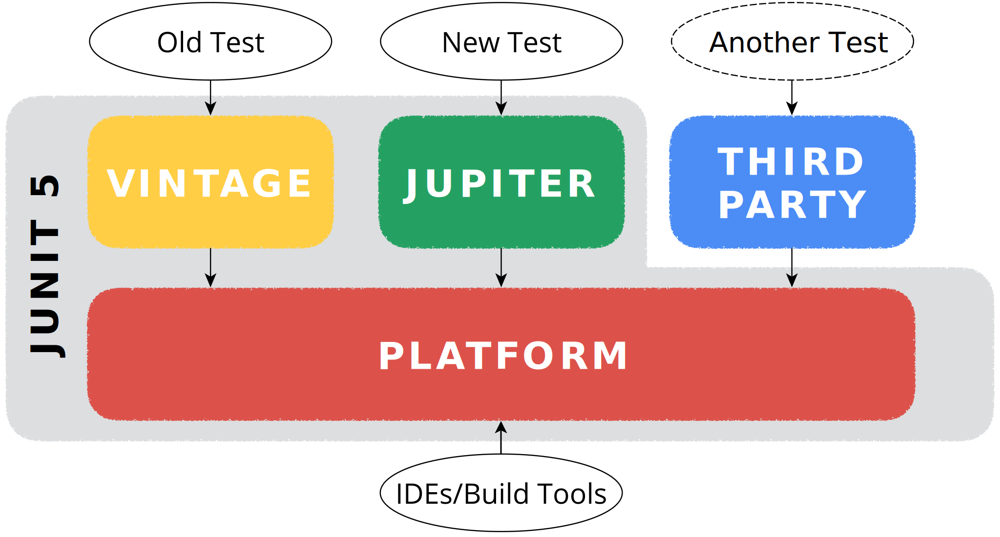

<!-- .slide: data-background="/assets/entwicklertag-background.jpg" -->
# Neues von JUnit 5
<!-- .element style="color:#fff;" -->

<hr style="border-color:#fff; width:25%; background-color:#fff">

### From Revolution to Continuous Evolution
<!-- .element style="color:#fff" -->

----

##  <!-- .element style="width:32%; float:right;" --> Marc Philipp

*Software Engineer bei  <!-- .element class="plain" style="vertical-align:-16px; height:1.6em; padding-left:5px" -->*

JUnit Committer seit 2012
Team Lead seit 2016

*Twitter:* [@marcphilipp](https://twitter.com/marcphilipp)
*Web:* [marcphilipp.de](https://www.marcphilipp.de)

----

# ✋

## Show of Hands


----

## JUnit 5 releases

**5.0** -- 10. September 2017

**5.1** -- 18. Februar 2018

**5.2** -- 29. April 2018

**5.3** -- 11. September 2018

**5.4** -- 7. Februar 2019

**5.5** -- Juni 2019

----

## Agenda

1. Wie schreibt man Tests und Extensions mit JUnit 5?
2. Was ist die JUnit Platform und wozu ist sie gut?
3. Was kommt noch und die fängt man mit JUnit 5 an?

---

<!-- .slide: data-background="./jupiter.jpg" -->
# JUnit Jupiter
<!-- .element style="color:white; text-shadow:-1px 0 black, 0 1px black, 1px 0 black, 0 -1px black" -->

#### Das neue Testing Framework für Java
<!-- .element style="color:white; text-shadow:-1px 0 black, 0 1px black, 1px 0 black, 0 -1px black" -->

Image: NASA <!-- .element style="font-size: 10px; color:white" -->

----

## Jupiter? 🤔

> Is writing tests rocket science now?

Nein, "Jupiter" ist einfach ein neuer Name zur besseren Unterscheidung der verschiedenen Teile von JUnit 5.
<!-- .element: class="fragment" -->

... und es ist der fünfte Planet von der Sonne aus gezählt.
<!-- .element: class="fragment" -->

----

## Basics (Demo)

https://github.com/marcphilipp/junit5-demo/tree/20190603-etka

----

## Basics (Recap)

- `@Test` ist jetzt in `org.junit.jupiter.api`
- `@Disabled` anstatt `@Ignore`
- `@BeforeAll`, `@BeforeEach`, `@AfterEach`, `@AfterAll` haben neue Namen
- `Assertions` sehen ähnlich aus -- zusätzlich `assertThrows`, `assertAll`
- Eigene `@DisplayNames` statt Camel Case
- `@TestInstance(PER_METHOD` oder `PER_CLASS)`
- `@Tag` anstatt `@Category`

----

## Display name generators <span class="since">5.4</span>

```java
@DisplayNameGeneration(ReplaceUnderscores.class)
class A_year_is_not_supported {

	@Test
	void if_it_is_zero() {/*...*/}

	@ParameterizedTest
	@ValueSource(ints = { -1, -4 })
	void if_it_is_negative(int year) {/*...*/}
}
```
 <!-- .element style="border: 0; width:50%" -->

----

## Test method ordering <span class="since">5.4</span>

- `@TestMethodOrder(Random.class)` hilft sicherzustellen, dass Tests nicht Reihenfolge-abhängig sind
- `@TestMethodOrder(Alphanumeric.class)` und `@TestMethodOrder(OrderAnnotation.class)` für Integrationstests
- Erweiterbar: `MethodOrderer` implementieren

----

## Kotlin Support <span class="since">5.1</span>

```kotlin
import org.junit.jupiter.api.*

class KotlinAssertionsDemo {
    @Test
    fun `expected exception testing`() {
        val exception = assertThrows<ArithmeticException> {
            Calculator().divide(1, 0)
        }
        assertEquals("/ by zero", exception.message)
    }
    @Test
    fun `grouped assertions`() {
        assertAll("Person properties",
            { assertEquals("Jane", person.firstName) },
            { assertEquals("Doe", person.lastName) }
        )
    }
}
```

----

## Weitere Testarten (Demo)

https://github.com/marcphilipp/junit5-demo/tree/20190603-etka

----

## Weitere Testarten (Recap)

- `@ParameterizedTest` mit versch. `@Source`-Annotationen
  - `@ValueSource`, `@EnumSource`, `@CsvSource`, `@CsvFileSource`, `@MethodSource`, `@NullSource`&nbsp;<span class="since">5.4</span>, `@EmptySource`&nbsp;<span class="since">5.4</span>, `@ArgumentsSource(MyProvider.class)`, `@YourCustomSource`
- `@RepeatedTest` für "flaky" Tests
- `@TestFactory` um _dynamisch_ Tests zu produzieren

----

## Parallel Execution <span class="since">5.3</span> (Demo)

https://github.com/marcphilipp/junit5-demo/tree/20190603-etka

----

## Parallel Execution <span class="since">5.3</span> (Recap)

- Tests laufen standardmäßig sequenziell
- Parallele Ausführung lässt sich per Configuration Parameter aktivieren
- `@Execution(SAME_THREAD` oder `CONCURRENT)`
- `@ResourceLock` zur deklarativen Synchronisation

----

## Extensions (Demo)

https://github.com/marcphilipp/junit5-demo/tree/20190603-etka

----

## Extensions (Recap)

- Registrierung (beliebig viele gleichzeitig):
  - Deklarativ: `@ExtendWith` an Klassen oder Methoden
  - Programmatisch: `@RegisterExtension` an Feldern <span class="since">5.1</span>
  - Global: per `ServiceLoader` (s. [User Guide](https://junit.org/junit5/docs/current/user-guide/#extensions-registration-automatic))
- Implementierung:
  - `Extension` Marker Interface
  - _1_ Extension -- _n_ Extension Points/Interfaces

----

## Composed Annotations

Jupiter-Annotation können als Meta-Annotation verwendet werden, um eigene Annotationen zu definieren.

```java
@Retention(RUNTIME)
@Target(METHOD)
@ExtendWith(DisabledOnWeekdaysExtension.class)
@Tag("example")
public @interface DisabledOnWeekdays {
    DayOfWeek[] value();
}
```

----

## Extension Points

- Lifecycle: `BeforeAllCallback`, `BeforeEachCallback`, `BeforeTestExecutionCallback`, `TestExecutionExceptionHandler`, `LifecycleMethodExecutionExceptionHandler`&nbsp;<span class="since">5.5</span>, `AfterTestExecutionCallback`, `AfterEachCallback`, `AfterAllCallback`, `InvocationInterceptor`&nbsp;<span class="since">5.5</span>
- Andere: `ExecutionCondition`, `ParameterResolver`, `TestInstanceFactory`&nbsp;<span class="since">5.3</span>, `TestInstancePostProcessor`, `TestWatcher`&nbsp;<span class="since">5.4</span>, `TestTemplateInvocationContextProvider`

----

## Temporäre Verzeichnisse <span class="since">5.4</span>

```java
import org.junit.jupiter.api.io.TempDir;

@Test
void writeAndReadFile(@TempDir Path tempDir) throws Exception {
    Path testFile = tempDir.resolve("test.txt");

    Files.write(testFile, asList("foo", "bar"));

    List<String> actualLines = Files.readAllLines(testFile);
    assertIterableEquals(asList("foo", "bar"), actualLines);
}
```

----

## Bedingte Ausführung <span class="since">5.1</span>

- `@EnabledOnOs`/`@DisabledOnOs({LINUX, MAC, …})`
- `@EnabledOnJre`/`@DisabledOnJre({JAVA_11, …})`
- `@Enabled`/`DisabledIfSystemProperty(named = "someKey", matches = "someValue")`
- `@Enabled`/`DisabledIfEnvironmentVariable(named = "SOME_KEY", matches = "SOME_VALUE")`
----

## Deklarative Timeouts <span class="since">5.5</span>

```java
@BeforeEach
@Timeout(10)
void setUp() {
    // schlägt fehl, falls Ausführung länger als 10 Sekunden dauert
}
@Test
@Timeout(value = 500, unit = MILLISECONDS)
void someTest() {
    // schlägt fehl, falls Ausführung länger als 500 Millisekunden dauert
}
```

----

## Third-Party Extensions

JUnit Pioneer, Spring, Mockito, Testcontainers, Docker, Wiremock, JPA, Selenium/WebDriver, DbUnit, Kafka, Jersey, GreenMail, S3Mock, Citrus Framework, XWiki, ...

<https://github.com/junit-team/junit5/wiki/Third-party-Extensions>

----

## Agenda

1. Wie schreibt man Tests und Extensions mit JUnit 5? ✅
2. Was ist die JUnit Platform und wozu ist sie gut?
3. Was kommt noch und die fängt man mit JUnit 5 an?

---

<!-- .slide: data-background="./mobile-launcher.jpg" -->
# JUnit Platform
<!-- .element style="color:black; text-shadow:-1px 0 white, 0 1px white, 1px 0 white, 0 -1px white" -->

#### Plattform zum Testen auf der JVM
<!-- .element style="color:black; text-shadow:-1px 0 white, 0 1px white, 1px 0 white, 0 -1px white" -->

Image: NASA <!-- .element style="font-size: 10px; color:white" -->

----

## JUnit als Plattform?

- JUnit war schon immer eine Plattform
  - für IDEs und Build Tools
  - für andere Testing Frameworks
- Enge Kopplung (interne APIs, Reflection, Serialization)


<!-- .element class="plain" style="height:7em" -->

----

## Coupling


<!-- .element class="plain" style="width:100%" -->

----

# 💡

> Wenn JUnit eine Plattform ist, dann sollten wir die Architektur darauf auslegen!

----

## Trennung von Verantwortlichkeiten

1. API zum Schreiben von Tests und Extensions (Jupiter API)
1. Erweiterbarer Mechanismus zum Auffinden und Ausführen von Tests (Test Engine SPI)
1. API zur Testausführung durch IDEs und Build Tools (Launcher API)

----

## Design-Ziele

- *Flexibilität:* Neue Features hinzuzufügen ist einfach. Es ist klar, ob eine Änderung problematisch ist oder nicht.
- *Rückwärtskompatibilität:* JUnit 3/4 Tests laufen immer noch
- *Vorwärtskompatibilität:* Alte IDEs und Build Tools können neue Tests ausführen

----


<!-- .element class="plain" style="width:100%" -->

----

## JUnit 5 <br> = <br> Jupiter + Vintage + Platform

----

## Third-party Engines

Specsy, Spek, KotlinTest, Cucumber, Drools, jqwik, Brahms, Mainrunner, ...

<https://github.com/junit-team/junit5/wiki/Third-party-Extensions>

----

## Mehrere Test Engines (Demo)

<https://github.com/marcphilipp/junit5-platform-demo>

----

## Mehrere Test Engines (Recap)

- Mehrere Test Engines können in einem Testlauf verwendet werden
- Unterscheidung zwischen Abhängigkeiten in `testImplementation` und `testRuntimeOnly`
- Erlaubt eine schrittweise Migration von einer Test Engine zur anderen (z.B. von Vintage nach Jupiter)

----

## Kompatibilität / Migration

- Vintage Engine führt JUnit 3/4 Tests auf der Plattform aus
- `@Category(UI.class)` entspricht `com.acme.UI`-Tag
- Teilweise Unterstützung von JUnit 4 `Rules`
- Unterstützung von `@Ignore` <span class="since">5.4</span>
- IDEs können Testklassen in die Jupiter API konvertieren
- Migrationswerkzeug aus der Community:
  <https://github.com/junit-pioneer/convert-junit4-to-junit5>

----

## Build Tools

- Gradle (≥ 4.6), Ant (≥ 1.10.3) und Maven Surefire (≥ 2.22.0) unterstützen die JUnit Platform
- Mit dem `ConsoleLauncher` kann man Tests über die Kommandozeile ausführen und in andere Build Tools (z.B. Bazel) integrieren

----

## IDEs

- Sehr gute Unterstützung
  - IntelliJ IDEA (≥ 2016.2)
  - Eclipse (≥ 4.7.1a)
  - Visual Studio Code (Java Test Runner ≥ 0.4.0)
  - Netbeans (≥ 10.0)
- Für andere IDEs gibt es `@RunWith(JUnitPlatform)`

----

## Tag Expressions <span class="since">5.1</span>

Erlauben präzise anzugeben, welche Tests basierend auf Tags ausgeführt werden sollen:

```kotlin
test {
    useJUnitPlatform {
        includeTags("(smoke & feature-a) | (!smoke & feature-b)")
    }
}
```

----

## Unterstützung für <br>Module <span class="since">5.1</span>

Alle Tests in einem Modul ausführen:
```sh
$ java -jar junit-platform-console-standalone-1.4.0.jar \
       --select-module com.acme.foo
```

Den Modulpfad scannen:
```sh
$ java -jar junit-platform-console-standalone-1.4.0.jar \
       --scan-modules
```

----

## Agenda

1. Wie schreibt man Tests und Extensions mit JUnit 5? ✅
2. Was ist die JUnit Platform und wozu ist sie gut? ✅
3. Was kommt noch und die fängt man mit JUnit 5 an?

---

<!-- .slide: data-background="./andromeda-galaxy.jpg" -->
# Roadmap und Ressourcen
<!-- .element style="color:white; text-shadow:-1px 0 black, 0 1px black, 1px 0 black, 0 -1px black" -->

Image: NASA <!-- .element style="font-size: 10px; color:white" -->

----

## Roadmap

- Wiederverwendbare Discovery für Test Engines <span class="since">5.5 M1</span>
- Testausführung in nutzerdefinierten Threads <span class="since">5.5 RC1</span>
- Deklarative/globale Timeouts <span class="since">5.5 RC1</span>
- Reporting-Format, das neue Features unterstützt (z.B.&nbsp;Tags, Display Names, Report Entries) <span class="since">5.6 M1</span>
- Deklarative Test Suiten
- Parametrisierte Testklassen
- _Eure Ideen?_

----

## Loslegen? Loslegen!

* User Guide:
  http://junit.org/junit5/docs/current/user-guide/
* Beispielprojekte für Ant, Bazel, Gradle und Maven:
  https://github.com/junit-team/junit5-samples
* Javadoc:
  http://junit.org/junit5/docs/current/api/

----

## Gesucht: Feedback!

* StackOverflow:
  http://stackoverflow.com/questions/tagged/junit5
* Code & Issues:
  https://github.com/junit-team/junit5/
* Chat mit dem Team:
  https://gitter.im/junit-team/junit5
* Twitter:
  https://twitter.com/junitteam

----

## Unterstützt das JUnit-Team!

https://junit.org/sponsoring


<!-- .element class="plain" -->

----

## Beispiel-Code

* Jupiter:
  https://github.com/marcphilipp/junit5-demo/tree/20190603-etka
* Platform:
  https://github.com/marcphilipp/junit5-platform-demo

----

# Fragen?

[@marcphilipp](https://twitter.com/marcphilipp) / [@junitteam](https://twitter.com/junitteam) auf Twitter

----

# Vielen Dank!

----

<!-- .slide: data-background="./etka-feedback.svg" -->
