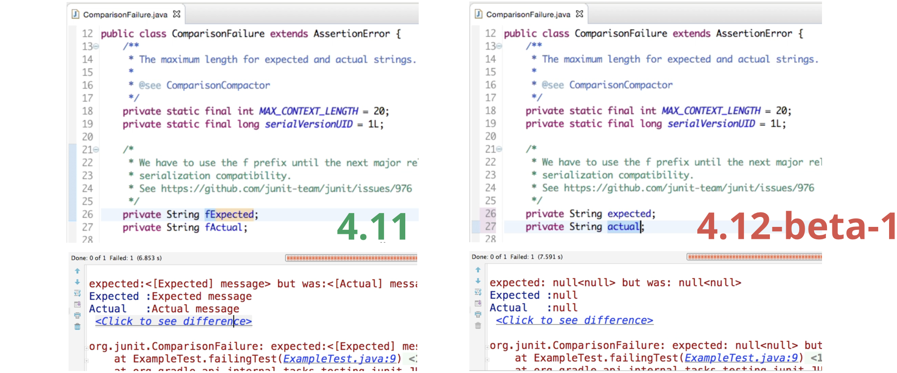

<!-- .slide: data-background="/assets/jeeconf-background.jpg" -->
# News from JUnit 5
<!-- .element style="color:#fff;" -->

<hr style="border-color:#fff; width:25%; background-color:#fff">

### From Revolution to Continuous Evolution
<!-- .element style="color:#fff" -->

----

##  <!-- .element style="width:32%; float:right;" --> Marc Philipp

*Software Engineer at  <!-- .element class="plain" style="vertical-align:-16px; height:1.6em; padding-left:5px" -->*

JUnit committer since 2012
team lead since 2016

*Twitter:* [@marcphilipp](https://twitter.com/marcphilipp)
*Web:* [marcphilipp.de](https://www.marcphilipp.de)

----

# ✋

## Show of Hands


----

## JUnit 5 releases

**5.0** -- September 10, 2017

**5.1** -- February 18, 2018

**5.2** -- April 29, 2018

**5.3** -- September 11, 2018

**5.4** -- February 7, 2019

----

## Agenda

1. How to write tests and extensions using JUnit 5?
2. What is the JUnit Platform and why do we need it?
3. What's still to come and how to get started?

---

<!-- .slide: data-background="./jupiter.jpg" -->
# JUnit Jupiter
<!-- .element style="color:white; text-shadow:-1px 0 black, 0 1px black, 1px 0 black, 0 -1px black" -->

#### The new Testing Framework for Java
<!-- .element style="color:white; text-shadow:-1px 0 black, 0 1px black, 1px 0 black, 0 -1px black" -->

Image: NASA <!-- .element style="font-size: 10px; color:white" -->

----

## Jupiter? 🤔

> Is writing tests rocket science now?

Nope, it's just a new name so we can easily distinguish it from the old JUnit and the other parts of JUnit 5.
<!-- .element: class="fragment" -->

... and it's the fifth planet from the sun.
<!-- .element: class="fragment" -->

----

## Basics (Demo)

https://github.com/marcphilipp/junit5-demo/tree/20190427-jeeconf

----

## Basics (Recap)

- `@Test` is still a thing, but in `org.junit.jupiter.api`
- `@Disabled` instead of `@Ignore`
- `@BeforeAll`, `@BeforeEach`, `@AfterEach`, `@AfterAll` have new names
- `Assertions` look similar -- a few new ones like `assertThrows`, `assertAll`
- Custom `@DisplayNames` to ease camel-case fatigue
- `@TestInstance(PER_METHOD` or `PER_CLASS)`
- `@Tag` instead of `@Category`

----

## Display name generators <span class="since">5.4</span>

```java
@DisplayNameGeneration(ReplaceUnderscores.class)
class A_year_is_not_supported {

	@Test
	void if_it_is_zero() {/*...*/}

	@ParameterizedTest
	@ValueSource(ints = { -1, -4 })
	void if_it_is_negative(int year) {/*...*/}
}
```
 <!-- .element style="border: 0; width:50%" -->

----

## Test method ordering <span class="since">5.4</span>

- `@TestMethodOrder(Random.class)` to ensure tests don't rely on any order
- `@TestMethodOrder(Alphanumeric.class)` and `@TestMethodOrder(OrderAnnotation.class)` for integration tests
- Extensible: implement `MethodOrderer`

----

## Kotlin Support <span class="since">5.1</span>

```kotlin
import org.junit.jupiter.api.*

class KotlinAssertionsDemo {
    @Test
    fun `expected exception testing`() {
        val exception = assertThrows<ArithmeticException> {
            Calculator().divide(1, 0)
        }
        assertEquals("/ by zero", exception.message)
    }
    @Test
    fun `grouped assertions`() {
        assertAll("Person properties",
            { assertEquals("Jane", person.firstName) },
            { assertEquals("Doe", person.lastName) }
        )
    }
}
```

----

## More ways to test (Demo)

https://github.com/marcphilipp/junit5-demo/tree/20190427-jeeconf

----

## More ways to test (Recap)

- `@ParameterizedTest` with different `@Source` annotations
  - `@ValueSource`, `@EnumSource`, `@CsvSource`, `@CsvFileSource`, `@MethodSource`, `@NullSource`&nbsp;<span class="since">5.4</span>, `@EmptySource`&nbsp;<span class="since">5.4</span>, `@ArgumentsSource(MyProvider.class)`, `@YourCustomSource`
- `@RepeatedTest` for flaky tests
- `@TestFactory` to produce _dynamic_ tests

----

## Parallel Execution <span class="since">5.3</span> (Demo)

https://github.com/marcphilipp/junit5-demo/tree/20190427-jeeconf

----

## Parallel Execution <span class="since">5.3</span> (Recap)

- Tests are run sequentially by default
- Opt-in and configure parallel execution via configuration parameters
- `@Execution(SAME_THREAD` or `CONCURRENT)`
- Use `@ResourceLock` as declarative synchronization mechanism

----

## Extensions (Demo)

https://github.com/marcphilipp/junit5-demo/tree/20190427-jeeconf

----

## Extensions (Recap)

- Registration (as many as you need):
  - Declarative: `@ExtendWith` on classes or methods
  - Programmatic: `@RegisterExtension` on fields <span class="since">5.1</span>
  - Global: Via `ServiceLoader` (see [User Guide](https://junit.org/junit5/docs/current/user-guide/#extensions-registration-automatic))
- Implementation:
  - `Extension` marker interface
  - one extension -- _n_ extension points/interfaces

----

## Composed Annotations

Use Jupiter annotations as meta-annotations to create your own annotations.

```java
@Retention(RUNTIME)
@Target(METHOD)
@ExtendWith(ConferenceExecutionCondition.class)
@Tag("example")
public @interface DisabledOnConference {}
```

----

## Extension Points

- Lifecycle: `BeforeAllCallback`, `BeforeEachCallback`, `BeforeTestExecutionCallback`, `TestExecutionExceptionHandler`, `AfterTestExecutionCallback`, `AfterEachCallback`, `AfterAllCallback`
- Other: `ExecutionCondition`, `ParameterResolver`, `TestInstanceFactory`&nbsp;<span class="since">5.3</span>, `TestInstancePostProcessor`, `TestWatcher`&nbsp;<span class="since">5.4</span>, `TestTemplateInvocationContextProvider`

----

## Built-in temp dir support <span class="since">5.4</span>

```java
import org.junit.jupiter.api.io.TempDir;

@Test
void writeAndReadFile(@TempDir Path tempDir) throws Exception {
    Path testFile = tempDir.resolve("test.txt");

    Files.write(testFile, asList("foo", "bar"));

    List<String> actualLines = Files.readAllLines(testFile);
    assertIterableEquals(asList("foo", "bar"), actualLines);
}
```

----

## Built-in conditions <span class="since">5.1</span>

- `@EnabledOnOs`/`@DisabledOnOs({LINUX, MAC, …})`
- `@EnabledOnJre`/`@DisabledOnJre({JAVA_11, …})`
- `@Enabled`/`DisabledIfSystemProperty(named = "someKey", matches = "someValue")`
- `@Enabled`/`DisabledIfEnvironmentVariable(named = "SOME_KEY", matches = "SOME_VALUE")`

----

## Third-Party Extensions

JUnit Pioneer, Spring, Mockito, Testcontainers, Docker, Wiremock, JPA, Selenium/WebDriver, DbUnit, Kafka, Jersey, GreenMail, S3Mock, Citrus Framework, XWiki, ...

<https://github.com/junit-team/junit5/wiki/Third-party-Extensions>

----

## Agenda

1. How to write tests and extensions using JUnit 5? ✅
2. What is the JUnit Platform and why do we need it?
3. What's still to come and how to get started?

---

<!-- .slide: data-background="./mobile-launcher.jpg" -->
# JUnit Platform
<!-- .element style="color:black; text-shadow:-1px 0 white, 0 1px white, 1px 0 white, 0 -1px white" -->

#### Platform for Testing on the JVM
<!-- .element style="color:black; text-shadow:-1px 0 white, 0 1px white, 1px 0 white, 0 -1px white" -->

Image: NASA <!-- .element style="font-size: 10px; color:white" -->

----

## JUnit as a Platform?

- JUnit has always been a platform
  - for IDEs and build tools
  - for other testing frameworks
- Closely coupled (internal APIs, reflection, serialization)


<!-- .element class="plain" style="height:7em" -->


----

## Coupling


<!-- .element class="plain" style="width:100%" -->

----

# 💡

> If JUnit is a platform, let's design for it!

----

## Separation of Concerns

1. An API to write tests and extensions (Jupiter API)
1. Extensible mechanisms to discover and execute tests (Test Engine SPI)
1. An API for test execution by tools (Launcher API)


----

## Design Goals

- *Flexibility:* Adding new features should be easy. It should be clear whether a change might potentially break a client.
- *Backward Compatibility:* Test written with JUnit 3 and 4 should still run
- *Forward Compatibility:* Old IDEs and build tools should be able to execute new tests

----


<!-- .element class="plain" style="width:100%" -->

----

## JUnit 5 <br> = <br> Jupiter + Vintage + Platform

----

## Compatibility / Migration

- Vintage Engine to run JUnit 3/4 tests on the Platform
- `@Category(UI.class)` maps to `com.acme.UI` tag
- Limited support for JUnit 4 `Rules` to ease migration
- Migration support for `@Ignore`  <span class="since">5.4</span>
- IDEs provide tools to convert test classes to Jupiter API
- Community-provided migration tool:
  <https://github.com/boyarsky/convert-junit4-to-junit5>

----

## Build Tool Support

- Native support in Gradle (≥ 4.6), Ant (≥ 1.10.3), and Maven Surefire (≥ 2.22.0)
- `ConsoleLauncher` to run tests from the command line or to support other build tools (e.g. Bazel)

----

## IDE Support

- Excellent support
  - IntelliJ IDEA (≥ 2016.2)
  - Eclipse (≥ 4.7.1a)
  - Visual Studio Code (Java Test Runner ≥ 0.4.0)
  - Netbeans (≥ 10.0)
- For other tools, there's `@RunWith(JUnitPlatform)`

----

## Third-party Engines

Specsy, Spek, KotlinTest, Cucumber, Drools, jqwik, Brahms, Mainrunner, ...

<https://github.com/junit-team/junit5/wiki/Third-party-Extensions>

----

## Using multiple Engines (Demo)

<https://github.com/marcphilipp/junit5-platform-demo>

----

## Using multiple Engines (Recap)

- Multiple test engines can be used in a single test run
- Distinction between `testImplementation` and `testRuntimeOnly` dependencies
- Allows to gradually migrate tests from one test engine to another (e.g. from Vintage to Jupiter)

----

## Tag Expressions <span class="since">5.1</span>

Precisely specify which tests to run based on tags:

```kotlin
test {
    useJUnitPlatform {
        includeTags("(smoke & feature-a) | (!smoke & feature-b)")
    }
}
```

----

## Support for Java Modules <span class="since">5.1</span>

Execute all tests in a module:
```sh
$ java -jar junit-platform-console-standalone-1.4.0.jar \
       --select-module com.acme.foo
```

Scan the module path:
```sh
$ java -jar junit-platform-console-standalone-1.4.0.jar \
       --scan-modules
```

----

## Agenda

1. How to write tests and extensions using JUnit 5? ✅
2. What is the JUnit Platform and why do we need it? ✅
3. What's still to come and how to get started?

---

<!-- .slide: data-background="./andromeda-galaxy.jpg" -->
# Roadmap and Resources
<!-- .element style="color:white; text-shadow:-1px 0 black, 0 1px black, 1px 0 black, 0 -1px black" -->

Image: NASA <!-- .element style="font-size: 10px; color:white" -->

----

## Important Future Milestones

- Reusable test discovery for test engines <span class="since">5.5 M1</span>
- Executing tests in user-defined threads <span class="since">5.5 M2</span>
- Declarative/global timeouts <span class="since">5.5 M2</span>
- New reporting format that supports new features (e.g. tags, display names, report entries)
- Declarative Test Suites
- Parameterized Test Classes
- _Your ideas?_

----

## Getting Started

* User Guide:
  http://junit.org/junit5/docs/current/user-guide/
* Sample projects for Ant, Bazel, Gradle, and Maven:
  https://github.com/junit-team/junit5-samples
* Javadoc:
  http://junit.org/junit5/docs/current/api/

----

## Wanted: Feedback!

* StackOverflow:
  http://stackoverflow.com/questions/tagged/junit5
* Code & Issues:
  https://github.com/junit-team/junit5/
* Chat with the team:
  https://gitter.im/junit-team/junit5
* Twitter:
  https://twitter.com/junitteam

----

## Support JUnit

Support the JUnit team with donations:
  https://junit.org/sponsoring


<!-- .element class="plain" style="width:35%" -->

----

## Example code

* Jupiter:
  https://github.com/marcphilipp/junit5-demo/tree/20190427-jeeconf
* Platform:
  https://github.com/marcphilipp/junit5-platform-demo

----

# Questions?

[@marcphilipp](https://twitter.com/marcphilipp) / [@junitteam](https://twitter.com/junitteam) on Twitter

----

# Дякую!
