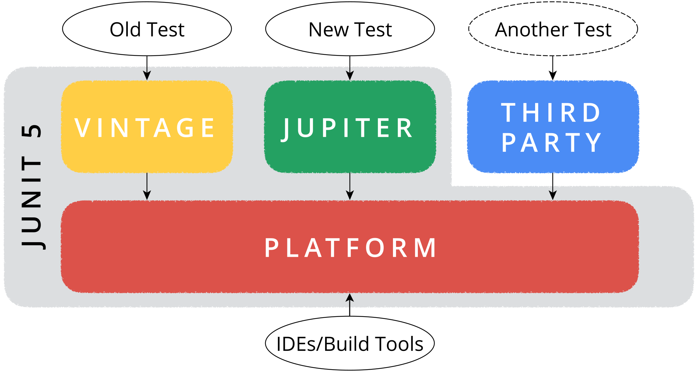

<!-- .slide: data-background="./jax-background.jpg" -->
# JUnit 5
<!-- .element style="color:white; margin-top:2.2em" -->

#### The new Testing Framework for Java<br>and Platform for the JVM
<!-- .element style="color:white" -->

----

##  <!-- .element style="width:30%; float:right;" --> Marc Philipp

*Software Engineer at  <!-- .element class="plain" style="vertical-align: -35px; height:2em;" -->*

JUnit Maintainer since 2012

*Twitter:* [@marcphilipp](https://twitter.com/marcphilipp)
*Web:* [marcphilipp.de](https://www.marcphilipp.de)

----

## 🎉<br>JUnit 5 is here!

**5.0**
September 10, 2017

**5.1**
February 18, 2018

**5.2**
*April 29, 2018*

----

## Agenda

1. How to write tests and extensions using JUnit 5?
2. What is the JUnit Platform and why do we need it?
3. What's still to come and how to get started?

---

<!-- .slide: data-background="./jupiter.jpg" -->
# JUnit Jupiter
<!-- .element style="color:white; text-shadow:-1px 0 black, 0 1px black, 1px 0 black, 0 -1px black" -->

#### The new Testing Framework for Java
<!-- .element style="color:white; text-shadow:-1px 0 black, 0 1px black, 1px 0 black, 0 -1px black" -->

Image: NASA <!-- .element style="font-size: 10px; color:white" -->

----

## Jupiter? 🤔

> Is writing tests rocket science now?

Nope, it's just a new name so we can easily distinguish it from the old JUnit and the other parts of JUnit 5.
<!-- .element: class="fragment" -->

... and it's the fifth planet from the sun.
<!-- .element: class="fragment" -->

----

## Basics (Demo)

https://github.com/marcphilipp/junit5-demo/tree/20180425-jax

----

## Basics (Recap)

- `@Test` is still a thing, but in `org.junit.jupiter.api`
- `@BeforeAll`, `@BeforeEach`, `@AfterEach`, `@AfterAll` have new names
- `Assertions` look similar -- a few new ones like `assertThrows`, `assertAll`
- Custom `@DisplayNames` to ease camel-case fatigue
- `@TestInstance(PER_METHOD` or `PER_CLASS)`
- `@Tag` instead of `@Category`

----

## More ways to test (Demo)

https://github.com/marcphilipp/junit5-demo/tree/20180425-jax

----

## More ways to test (Recap)

- `@ParameterizedTest` with different `@Source` annotations
  - `@ValueSource`, `@EnumSource`, `@CsvSource`, `@CsvFileSource`, `@MethodSource`, `@ArgumentsSource(MyProvider.class)`, `@YourCustomSource`
- `@RepeatedTest` for flaky tests
- `@TestFactory` to produce _dynamic_ tests

----

## Extensions (Demo)

https://github.com/marcphilipp/junit5-demo/tree/20180425-jax

----

## Extensions (Recap)

- Registration (as many as you need):
  - Declarative: `@ExtendWith` on classes or methods
  - Programmatic: `@RegisterExtension` on fields
  - Global: Via `ServiceLoader` (see [User Guide](https://junit.org/junit5/docs/current/user-guide/#extensions-registration-automatic))
- Implementation:
  - `Extension` marker interface
  - one extension -- _n_ extension points/interfaces

----

## Composed Annotations

You can combine Jupiter annotations by meta-annotating your own annotation.

```java
@Retention(RUNTIME)
@Target(METHOD)
@ExtendWith(ConferenceExecutionCondition.class)
@Tag("example")
public @interface DisabledOnConference {}
```

----

## Extension Points

- Lifecycle: `BeforeAllCallback`, `BeforeEachCallback`, `BeforeTestExecutionCallback`, `TestExecutionExceptionHandler`, `AfterTestExecutionCallback`, `AfterEachCallback`, `AfterAllCallback`
- Other: `ExecutionCondition`, `TestInstancePostProcessor`, `ParameterResolver`, `TestTemplateInvocationContextProvider`

----

## Third-Party Extensions

Spring, Mockito, Docker, Wiremock, JPA, Selenium/WebDriver, DbUnit, Kafka, Jersey, GreenMail, S3Mock, Citrus Framework, XWiki, ...

<https://github.com/junit-team/junit5/wiki/Third-party-Extensions>

----

## Agenda

1. How to write tests and extensions using JUnit 5? ✅
2. What is the JUnit Platform and why do we need it?
3. What's still to come and how to get started?

---

<!-- .slide: data-background="./space-shuttle-launchpad.jpg" -->
# JUnit Platform
<!-- .element style="color:white; text-shadow:-1px 0 black, 0 1px black, 1px 0 black, 0 -1px black" -->

#### Platform for Testing on the JVM
<!-- .element style="color:white; text-shadow:-1px 0 black, 0 1px black, 1px 0 black, 0 -1px black" -->

Image: NASA <!-- .element style="font-size: 10px; color:white" -->

----

## JUnit as a Platform?

- JUnit has always been a platform
  - for IDEs and build tools
  - for other testing frameworks
- Closely coupled (internal APIs, reflection, serialization)


<!-- .element class="plain" style="height:7em" -->


----

## Coupling


<!-- .element class="plain" style="width:100%" -->

----

# 💡

> JUnit is a Platform --- let's design for it!

----

## Separation of Concerns

1. An API to write tests and extensions (Jupiter API)
1. Extensible mechanisms to discover and execute tests (Test Engine SPI)
1. An API for test execution by tools (Launcher API)


----

## Design Goals

- *Flexibility:* Adding new features should be easy. It should be clear whether a change might potentially break a client.
- *Backward Compatibility:* Test written with JUnit 3 and 4 should still run
- *Forward Compatibility:* Old IDEs and build tools should be able to execute new tests

----


<!-- .element class="plain" style="width:100%" -->

----

## JUnit 5
## =
## Jupiter + Vintage + Platform

----

## Third-party Engines

Specsy, Spek, KotlinTest, Cucumber, Drools, jqwik, ...

<https://github.com/junit-team/junit5/wiki/Third-party-Extensions>

> Talk about **jqwik** by [@johanneslink](https://twitter.com/johanneslink)
> 👉 11:45 in Gutenberg 1 👈

----

## Compatibility / Migration

- Vintage Engine to run JUnit 3/4 tests on the Platform
- `@Category(UI.class)` maps to `com.acme.UI` tag
- Limited support for JUnit 4 `Rules` to ease migration
- IDEs provide tools to convert test classes to Jupiter API
- Community-provided migration tool:
  <https://github.com/boyarsky/convert-junit4-to-junit5>

----

## Build Tool Support

- Native support in Gradle (≥ 4.6) and Ant (≥ 1.10.3)
- Support for Maven Surefire/Failsafe via a custom provider (currently being donated to Apache)
- `ConsoleLauncher` to run tests from the command line

----

## IDE Support

- Excellent support
  - IntelliJ IDEA (≥ 2016.2)
  - Eclipse (≥ 4.7.1a)
  - Visual Studio Code (Java Test Runner ≥ 0.4.0)
- For other tools, there's `@RunWith(JUnitPlatform)`

----

## Using multiple Engines (Demo)

<https://github.com/marcphilipp/junit5-platform-demo>

----

## Using multiple Engines (Recap)

- Multiple test engines can be used in a single test run
- Distinction between `testCompile` and `testRuntime` dependencies
- Allows to gradually migrate tests from one test engine to another (e.g. from Vintage to Jupiter)

----

## Agenda

1. How to write tests and extensions using JUnit 5? ✅
2. What is the JUnit Platform and why do we need it? ✅
3. What's still to come and how to get started?

---

<!-- .slide: data-background="./andromeda-galaxy.jpg" -->
# Roadmap and Resources
<!-- .element style="color:white; text-shadow:-1px 0 black, 0 1px black, 1px 0 black, 0 -1px black" -->

Image: NASA <!-- .element style="font-size: 10px; color:white" -->

----

## Important Future Milestones

- Parallel test execution
- Release of donated provider for Apache Maven Surefire
- New reporting format to support new features
- Parameterized Classes
- Scenario Tests
- ...

----

## Getting Started

* User Guide:
  http://junit.org/junit5/docs/current/user-guide/
* Sample projects for Gradle, Maven, and Ant:
  https://github.com/junit-team/junit5-samples
* Javadoc:
  http://junit.org/junit5/docs/current/api/

----

## Wanted: Feedback!

* StackOverflow:
  http://stackoverflow.com/questions/tagged/junit5
* Code & Issues:
  https://github.com/junit-team/junit5/
* Twitter:
  https://twitter.com/junitteam

----

## Example code

* Jupiter:
  https://github.com/marcphilipp/junit5-demo/tree/20180425-jax
* Platform:
  https://github.com/marcphilipp/junit5-platform-demo

----

# Questions?

&nbsp;

[@marcphilipp](https://twitter.com/marcphilipp) from [@junitteam](https://twitter.com/junitteam)

----

# Thanks!
