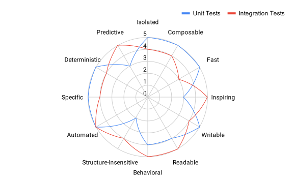

<!-- .slide: data-background="./chess.jpg" -->
# Productive Tests<!-- .element style="color:white; text-shadow: 1px 1px 5px black;" -->
## Marc Philipp<!-- .element style="color:white; text-shadow: 1px 1px 5px black;" -->

<a style="background-color:black;color:white;text-decoration:none;padding:4px 6px;font-family:-apple-system, BlinkMacSystemFont, &quot;San Francisco&quot;, &quot;Helvetica Neue&quot;, Helvetica, Ubuntu, Roboto, Noto, &quot;Segoe UI&quot;, Arial, sans-serif;font-size:10px;font-weight:bold;line-height:1.2;display:inline-block;border-radius:3px" href="https://unsplash.com/@jeshoots?utm_medium=referral&amp;utm_campaign=photographer-credit&amp;utm_content=creditBadge" target="_blank" rel="noopener noreferrer" title="Download free do whatever you want high-resolution photos from JESHOOTS.COM"><span style="display:inline-block;padding:2px 3px"><svg xmlns="http://www.w3.org/2000/svg" style="height:10px;width:auto;position:relative;vertical-align:middle;top:-2px;fill:white" viewBox="0 0 32 32"><title>unsplash-logo</title><path d="M10 9V0h12v9H10zm12 5h10v18H0V14h10v9h12v-9z"></path></svg></span><span style="display:inline-block;padding:2px 3px">JESHOOTS.COM</span></a>
----

## About me

----

## About you

---

<!-- .slide: data-background="bubbles.jpg" -->
# The case against integration tests<!-- .element style="color:white; text-shadow: 1px 1px 5px black;" -->

<a style="background-color:black;color:white;text-decoration:none;padding:4px 6px;font-family:-apple-system, BlinkMacSystemFont, &quot;San Francisco&quot;, &quot;Helvetica Neue&quot;, Helvetica, Ubuntu, Roboto, Noto, &quot;Segoe UI&quot;, Arial, sans-serif;font-size:10px;font-weight:bold;line-height:1.2;display:inline-block;border-radius:3px" href="https://unsplash.com/@lanju_fotografie?utm_medium=referral&amp;utm_campaign=photographer-credit&amp;utm_content=creditBadge" target="_blank" rel="noopener noreferrer" title="Download free do whatever you want high-resolution photos from Lanju Fotografie"><span style="display:inline-block;padding:2px 3px"><svg xmlns="http://www.w3.org/2000/svg" style="height:10px;width:auto;position:relative;vertical-align:middle;top:-2px;fill:white" viewBox="0 0 32 32"><title>unsplash-logo</title><path d="M10 9V0h12v9H10zm12 5h10v18H0V14h10v9h12v-9z"></path></svg></span><span style="display:inline-block;padding:2px 3px">Lanju Fotografie</span></a>
----

## Integrated Tests Are A Scam

Famous article/talk by J.B. Rainsberger

> Integrated tests are a scam—a self-replicating virus that threatens to infect your code base, your project, and your team with endless pain and suffering.

https://blog.thecodewhisperer.com/permalink/integrated-tests-are-a-scam
<!-- .element style="font-size:50%" -->

----

## Integrated vs. integration

> I use the term integrated test to mean any test whose result (pass or fail) depends on the correctness of the implementation of more than one "piece of non-trivial behavior".

----

## Why integrated tests are bad

- Slow, Brittle, Flaky
- You can never cover all branches
- Waste of time and money

----

## Test pyramid


https://martinfowler.com/bliki/TestPyramid.html (2012)

----

 ## unit test = good?

```
@Test void launcherCanExecuteTestPlan() {
	TestEngine engine = mock(TestEngine.class);
	when(engine.getId()).thenReturn("some-engine");
	when(engine.discover(any(), any())).thenAnswer(invocation -> {
		UniqueId uniqueId = invocation.getArgument(1);
		return new EngineDescriptor(uniqueId, uniqueId.toString());
	});

	var launcher = createLauncher(engine);
	TestPlan testPlan = launcher.discover(request().build());
	verify(engine, times(1)).discover(any(), any());

	launcher.execute(testPlan);
	verify(engine, times(1)).execute(any());
}
```

From [DefaultLauncherTests.java](https://github.com/junit-team/junit5/blob/d2c8d60fd5fdfdc32d075671f10a5bc0ecca3871/platform-tests/src/test/java/org/junit/platform/launcher/core/DefaultLauncherTests.java#L700-L715) in JUnit 5

----

## integration test = bad?

```java
static class TestCase {
    @ParameterizedTest @CsvSource({ "foo", "bar" })
    void testWithCsvSource(String argument) {
        fail(argument);
    }
}
@Test
void executesWithCsvSource() {
    var results = execute("testWithCsvSource", String.class);
    results.testEvents().assertThatEvents()
        .haveExactly(1, event(displayName("[1] argument=foo"),
            finishedWithFailure(message("foo"))))
        .haveExactly(1, event(displayName("[2] argument=bar"),
            finishedWithFailure(message("bar"))));
}
```

---

<!-- .slide: data-background="./stars.jpg" -->
# The case against unit tests<!-- .element style="color:white; text-shadow: 1px 1px 5px black;" -->

<a style="background-color:black;color:white;text-decoration:none;padding:4px 6px;font-family:-apple-system, BlinkMacSystemFont, &quot;San Francisco&quot;, &quot;Helvetica Neue&quot;, Helvetica, Ubuntu, Roboto, Noto, &quot;Segoe UI&quot;, Arial, sans-serif;font-size:10px;font-weight:bold;line-height:1.2;display:inline-block;border-radius:3px" href="https://unsplash.com/@grakozy?utm_medium=referral&amp;utm_campaign=photographer-credit&amp;utm_content=creditBadge" target="_blank" rel="noopener noreferrer" title="Download free do whatever you want high-resolution photos from Greg Rakozy"><span style="display:inline-block;padding:2px 3px"><svg xmlns="http://www.w3.org/2000/svg" style="height:10px;width:auto;position:relative;vertical-align:middle;top:-2px;fill:white" viewBox="0 0 32 32"><title>unsplash-logo</title><path d="M10 9V0h12v9H10zm12 5h10v18H0V14h10v9h12v-9z"></path></svg></span><span style="display:inline-block;padding:2px 3px">Greg Rakozy</span></a>
----

## "Most Unit Testing is Waste"

- "low (even potentially negative) payoff"
- "increase maintenance liabilities because they are less resilient against code changes"

https://rbcs-us.com/documents/Why-Most-Unit-Testing-is-Waste.pdf
https://blog.usejournal.com/lean-testing-or-why-unit-tests-are-worse-than-you-think-b6500139a009
http://250bpm.com/blog:40

----

### "Unit tests pass -- no integration tests" memes

 <!-- .element style="width:50%" -->

<!-- https://twitter.com/thepracticaldev/status/687672086152753152
https://twitter.com/erinfranmc/status/1148986961207730176 -->

----

## Controversial opinions?

> Write tests. Not too many. Mostly integration.
> --- Guillermo Rauch (@rauchg)
> [December 10, 2016](https://twitter.com/rauchg/status/807626710350839808?ref_src=twsrc%5Etfw)

----

## Test Pyramid, the fine print

> 2: The pyramid is based on the assumption that broad-stack tests are expensive, slow, and brittle compared to more focused tests, such as unit tests. While this is usually true, there are exceptions. If my high level tests are fast, reliable, and cheap to modify - then lower-level tests aren't needed.
<!-- .element style="font-size:80%" -->

https://martinfowler.com/bliki/TestPyramid.html
<!-- .element style="font-size:70%" -->

----

## The Testing Trophy

 <!-- .element style="width:400px; padding:10px; background: white" -->
https://twitter.com/kentcdodds/status/960723172591992832 <!-- .element style="font-size:70%" -->

----

## The Testing Trophy

> - as you move up the pyramid, the **confidence** quotient of each form of testing increases
> - our tools have moved beyond the assumption in Martin's original Testing Pyramid concept

https://kentcdodds.com/blog/write-tests

----

## Microservices Testing Honeycomb

 <!-- .element class="plain" style="width:33%" -->

https://labs.spotify.com/2018/01/11/testing-of-microservices/ <!-- .element style="font-size:70%" -->

----

## Microservices Testing Honeycomb

- "Integrated Test" = a test that will pass or fail based on the correctness of another system.
- "Integration Test" = verify the correctness of our service in a more isolated fashion while focusing on the interaction points and making them very explicit
- "Implementation Detail Test" = "unit test"

https://labs.spotify.com/2018/01/11/testing-of-microservices/ <!-- .element style="font-size:70%" -->

----

## Integration tests are bad!
## Unit tests are bad!
## ⇒ _All_ Tests are a Scam!? 😱

---

<!-- .slide: data-background="./dandelion.jpg" -->
# Test Desiderata<!-- .element style="color:white; text-shadow: 1px 1px 5px black;" -->

<a style="background-color:black;color:white;text-decoration:none;padding:4px 6px;font-family:-apple-system, BlinkMacSystemFont, &quot;San Francisco&quot;, &quot;Helvetica Neue&quot;, Helvetica, Ubuntu, Roboto, Noto, &quot;Segoe UI&quot;, Arial, sans-serif;font-size:10px;font-weight:bold;line-height:1.2;display:inline-block;border-radius:3px" href="https://unsplash.com/@davealmine?utm_medium=referral&amp;utm_campaign=photographer-credit&amp;utm_content=creditBadge" target="_blank" rel="noopener noreferrer" title="Download free do whatever you want high-resolution photos from Dawid Zawiła"><span style="display:inline-block;padding:2px 3px"><svg xmlns="http://www.w3.org/2000/svg" style="height:10px;width:auto;position:relative;vertical-align:middle;top:-2px;fill:white" viewBox="0 0 32 32"><title>unsplash-logo</title><path d="M10 9V0h12v9H10zm12 5h10v18H0V14h10v9h12v-9z"></path></svg></span><span style="display:inline-block;padding:2px 3px">Dawid Zawiła</span></a>

----

## Test Desiderata

- Recent blog post by Kent Beck
- Describes 12 desirable properties of tests

> Not all tests need to exhibit all properties. However, no property should be given up without receiving a property of greater value in return.

https://medium.com/@kentbeck_7670/test-desiderata-94150638a4b3

----

## Isolated

> tests should return the same results regardless of the order in which they are run.

----

## Composable

> if tests are isolated, then I can run 1 or 10 or 100 or 1,000,000 and get the same results.

----

## Fast

> tests should run quickly.

----

## Inspiring

> passing the tests should inspire confidence

----

## Writable

> tests should be cheap to write relative to the cost of the code being tested.

----

## Readable

> tests should be comprehensible for reader, invoking the motivation for writing this particular test.

----

## Behavioral

> tests should be sensitive to changes in the behavior of the code under test. If the behavior changes, the test result should change.

----

## Structure-insensitive

> tests should not change their result if the structure of the code changes.

----

## Automated

> tests should run without human intervention.

----

## Specific

> if a test fails, the cause of the failure should be obvious.

----

## Deterministic

> if nothing changes, the test result shouldn’t change.

----

## Predictive

> if the tests all pass, then the code under test should be suitable for production.

----

## Possible rating (context dependent!)


<!-- .element style="width:80%" -->

----

## So What?

> - Look at the last test you wrote.
> - Which properties does it have?
> - Which does it lack?
> - Is that the tradeoff you want to make?

---

<!-- .slide: data-background="./roundabout.jpg" -->

# <!-- .element class="plain" style="height:1.5em; background: transparent" -->
# Case Study: JUnit<!-- .element style="color:white; text-shadow: 1px 1px 5px black;" -->

<a style="background-color:black;color:white;text-decoration:none;padding:4px 6px;font-family:-apple-system, BlinkMacSystemFont, &quot;San Francisco&quot;, &quot;Helvetica Neue&quot;, Helvetica, Ubuntu, Roboto, Noto, &quot;Segoe UI&quot;, Arial, sans-serif;font-size:10px;font-weight:bold;line-height:1.2;display:inline-block;border-radius:3px" href="https://unsplash.com/@lmbrtt?utm_medium=referral&amp;utm_campaign=photographer-credit&amp;utm_content=creditBadge" target="_blank" rel="noopener noreferrer" title="Download free do whatever you want high-resolution photos from Thomas Lambert"><span style="display:inline-block;padding:2px 3px"><svg xmlns="http://www.w3.org/2000/svg" style="height:10px;width:auto;position:relative;vertical-align:middle;top:-2px;fill:white" viewBox="0 0 32 32"><title>unsplash-logo</title><path d="M10 9V0h12v9H10zm12 5h10v18H0V14h10v9h12v-9z"></path></svg></span><span style="display:inline-block;padding:2px 3px">Thomas Lambert</span></a>

----

## Test mix in JUnit

- Lots of unit tests
- Lots of integration tests
- A few end-to-end ("integrated") tests

----

## A simple unit test

```java
@Test
void assertSameWithSameObject() {
	Object foo = new Object();
	assertSame(foo, foo);
	assertSame(foo, foo, "message");
	assertSame(foo, foo, () -> "message");
}
```

Structure-insensitive ↑, Inspiring ↑, Writable ↑, Fast&nbsp;↑, ...

----

## A unit test with mocks

```
@Test void launcherCanExecuteTestPlan() {
	TestEngine engine = mock(TestEngine.class);
	when(engine.getId()).thenReturn("some-engine");
	when(engine.discover(any(), any())).thenAnswer(invocation -> {
		UniqueId uniqueId = invocation.getArgument(1);
		return new EngineDescriptor(uniqueId, uniqueId.toString());
	});

	var launcher = createLauncher(engine);
	TestPlan testPlan = launcher.discover(request().build());
	verify(engine, times(1)).discover(any(), any());

	launcher.execute(testPlan);
	verify(engine, times(1)).execute(any());
}
```

Structure-insensitive ↑, Inspiring →, Writable →, Fast&nbsp;↑, ...

----

## Another unit test

```java
@Test
void providesMultipleArguments() {
    CsvSource annotation = csvSource("foo", "bar");

    Stream<Object[]> arguments = provideArguments(annotation);

    assertThat(arguments)
        .containsExactly(array("foo"), array("bar"));
}
```
Structure-insensitive ↓, Inspiring →, Writable ↑, Fast&nbsp;↑, ...

----

## A typical integration test

```java
static class TestCase {
    @ParameterizedTest @CsvSource({ "foo", "bar" })
    void testWithCsvSource(String argument) {
        fail(argument);
    }
}
@Test
void executesWithCsvSource() {
    var results = execute("testWithCsvSource", String.class);
    results.testEvents().assertThatEvents()
        .haveExactly(1, event(displayName("[1] argument=foo"),
            finishedWithFailure(message("foo"))))
        .haveExactly(1, event(displayName("[2] argument=bar"),
            finishedWithFailure(message("bar"))));
}
```

Structure-insensitive ↑, Inspiring ↑, Writable →, Fast&nbsp;↑, ...

----

## End-to-end tests

```java
@Test void gradle_wrapper() {
	var result = Request.builder()
			.setTool(new GradleWrapper(Paths.get("..")))
			.setProject("gradle-starter")
			.addArguments("build", "--no-daemon", "--debug", "--stacktrace")
			.setTimeout(Duration.ofMinutes(2))
			.setJavaHome(Helper.getJavaHome("8").orElseThrow(TestAbortedException::new))
			.build()
			.run();p
	assumeFalse(result.isTimedOut(), () -> "tool timed out: " + result);
	assertEquals(0, result.getExitCode());
	assertTrue(result.getOutputLines("out").stream()
        .anyMatch(line -> line.contains("BUILD SUCCESSFUL")));
	assertThat(result.getOutput("out")).contains("Using Java version: 1.8");
}
```
Structure-insensitive ↑, Predictive ↑, Writable ↓, Fast&nbsp;↓ ...

---

<!-- .slide: data-background="./elephant.jpg" -->

# <!-- .element class="plain" style="height:1.5em; background:transparent" -->
# Case Study: Gradle<!-- .element style="color:white; text-shadow: 1px 1px 5px black;" -->

<a style="background-color:black;color:white;text-decoration:none;padding:4px 6px;font-family:-apple-system, BlinkMacSystemFont, &quot;San Francisco&quot;, &quot;Helvetica Neue&quot;, Helvetica, Ubuntu, Roboto, Noto, &quot;Segoe UI&quot;, Arial, sans-serif;font-size:10px;font-weight:bold;line-height:1.2;display:inline-block;border-radius:3px" href="https://unsplash.com/@fraumuksch?utm_medium=referral&amp;utm_campaign=photographer-credit&amp;utm_content=creditBadge" target="_blank" rel="noopener noreferrer" title="Download free do whatever you want high-resolution photos from Jennifer Latuperisa-Andresen"><span style="display:inline-block;padding:2px 3px"><svg xmlns="http://www.w3.org/2000/svg" style="height:10px;width:auto;position:relative;vertical-align:middle;top:-2px;fill:white" viewBox="0 0 32 32"><title>unsplash-logo</title><path d="M10 9V0h12v9H10zm12 5h10v18H0V14h10v9h12v-9z"></path></svg></span><span style="display:inline-block;padding:2px 3px">Jennifer Latuperisa-Andresen</span></a>
